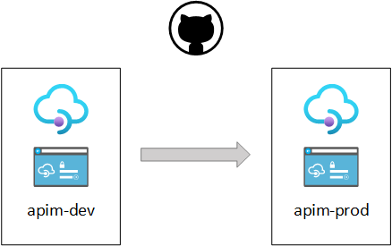
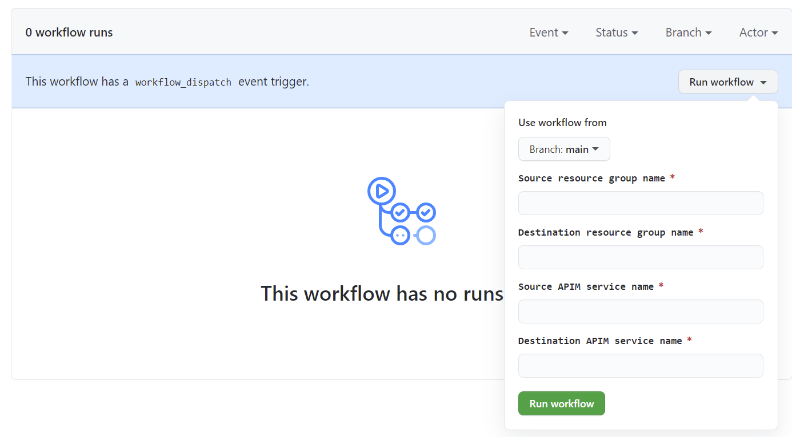

# Move Azure API Management assets with Github Actions

Using several [Azure API Management](https://docs.microsoft.com/en-us/azure/api-management/api-management-key-concepts) (APIM) services is useful to have distinct isolated environments, for instance one for development and another for production.
Moving assets between these environments can be done using various tools and automated with Github Actions.



This repository provides sample workflows in order to automate those common integration tasks.

## Copy APIM service

[copy-apim-service.yml](.github/workflows/copy-apim-service.yml) is a workflow that copy APIM assets from one service to another, including APIs, Products, Named Values, Backends, Policies and more.

> Everything is moved except the Developer portal and some settings : [What is not backed up](https://docs.microsoft.com/en-us/azure/api-management/api-management-howto-disaster-recovery-backup-restore#what-is-not-backed-up)

It uses the az cli [apim backup](https://docs.microsoft.com/en-US/cli/azure/apim?view=azure-cli-latest#az_apim_backup) and [apim restore](https://docs.microsoft.com/en-US/cli/azure/apim?view=azure-cli-latest#az_apim_restore) operations.


## Copy Developer Portal

[copy-apim-dev-portal.yml](.github/workflows/copy-apim-dev-portal.yml) is a workflow that copy developer portal content and customization from one source APIM service to another destination APIM service.
It uses a the [migrate.js](https://github.com/Azure/api-management-developer-portal/blob/master/scripts.v3/migrate.js) v3 provided on the the [APIM developer portal repo](https://github.com/Azure/api-management-developer-portal).

> More information about the whole process can be found on the Microsoft  documentation : [Automate developer portal deployments](https://docs.microsoft.com/en-us/azure/api-management/automate-portal-deployments)


## Requirements

In order to run these workflows you will need the following :
- A source APIM service
- A destination APIM service
- An [Azure Storage Account](https://docs.microsoft.com/en-us/azure/storage/common/storage-account-create) and a [Blob Container](https://docs.microsoft.com/en-us/azure/storage/blobs/storage-quickstart-blobs-portal) inside.  
- A [Service Principal](README.md#creating-the-service-principal)
- Some Github [Secrets](README.md#required-secrets) 

### Creating the Service Principal

In order Github Actions to log onto your Azure subscription and execute the steps you need to create a Service Principal with read/write permissions on the source and destination APIM services.
The below command line creates a Service Principal with Contributor role on a resource group (assuming both source and destination service are inside).

Replace <YOUR_SUBSCRIPTION_ID> and <YOUR_RESOURCE_GROUP_NAME> with appropriated values.

```
az ad sp create-for-rbac --name "git-actions-apim" --sdk-auth --role contributor \
--scopes /subscriptions/<YOUR_SUBSCRIPTION_ID>/resourceGroups/<YOUR_RESOURCE_GROUP_NAME>
```

Take note of the JSON output. It will be used further in the AZURE_CREDENTIALS secret.

``` 
{
  "clientId": "xxxxxxxx-xxxx-xxxx-xxxx-xxxxxxxxxxx",
  "clientSecret": "xxxxxxxxxxxxxxxxxxxxxxxxxxxxxx",
  "subscriptionId": "xxxxxxxx-xxxx-xxxx-xxxx-xxxxxxxxxxx",
  "tenantId": "xxxxxxxx-xxxx-xxxx-xxxx-xxxxxxxxxxx",
  "activeDirectoryEndpointUrl": "https://login.microsoftonline.com",
  "resourceManagerEndpointUrl": "https://management.azure.com/",
  "activeDirectoryGraphResourceId": "https://graph.windows.net/",
  "sqlManagementEndpointUrl": "https://management.core.windows.net:8443/",
  "galleryEndpointUrl": "https://gallery.azure.com/",
  "managementEndpointUrl": "https://management.core.windows.net/"
}
```

### Required Secrets

Secrets are encrypted environment variables. Using secrets is a best practice to pass sensitive informations such as keys or ids to your workflows in a secure manner.

The following secrets are needed:

| Secret name                                                                                              | Value 
|-------------------------------------------------------------------------------------------------------|--------------------------------------------------------------------------------------------------------|
| AZURE_CREDENTIALS                  | Credentials of the [Service Principal](README.md#creating-the-service-principal)             |
| SUBSCRIPTION_ID                     | ID of the Azure subscription where your APIM services are. [Find your Azure subscription](https://docs.microsoft.com/en-us/azure/media-services/latest/setup-azure-subscription-how-to) |
| STORAGE_NAME                         | Name of your Azure Storage Account.  |
| STORAGE_KEY                           | Access key of your Storage Account. [View account access keys](https://docs.microsoft.com/en-us/azure/storage/common/storage-account-keys-manage?#view-account-access-keys)  |

For more information on how to create Secrets check this doc : [Create secrets for Github workflows](https://github.com/Azure/actions-workflow-samples/blob/master/assets/create-secrets-for-GitHub-workflows.md)

## How to launch a workflow

These workflows implement the [workflow_dispatch](https://docs.github.com/en/actions/reference/events-that-trigger-workflows#workflow_dispatch) event trigger which allow to run them manually from the Actions tab.
Input source and destination resource groups/service names and run the workflow.

